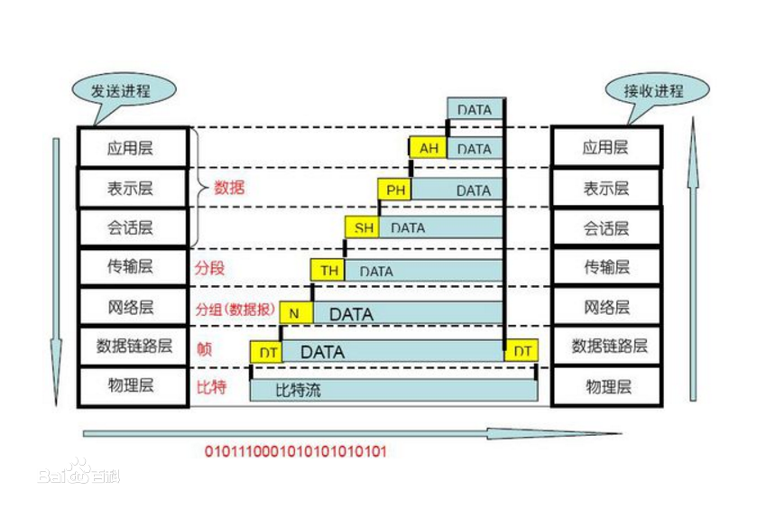
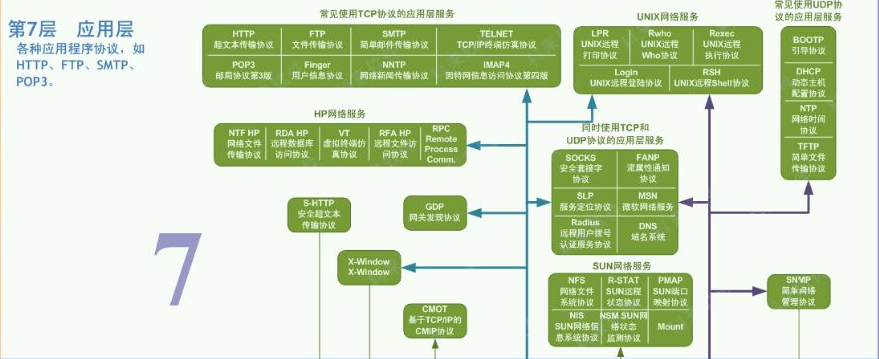
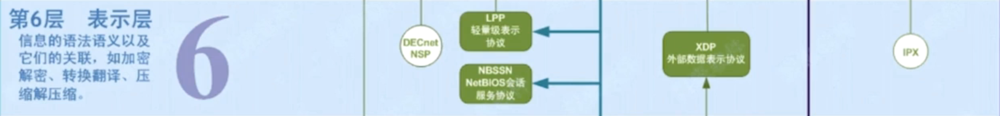
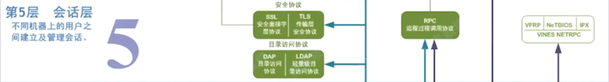
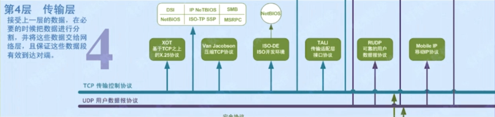
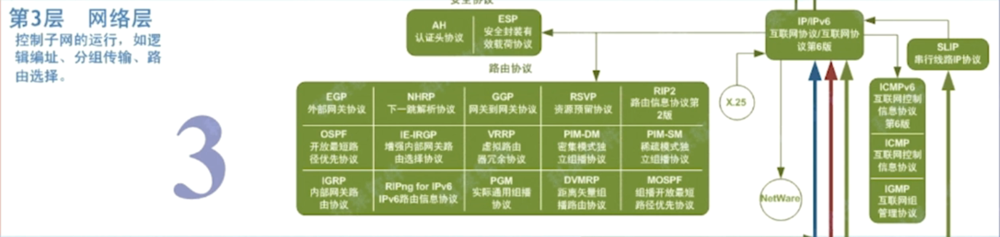
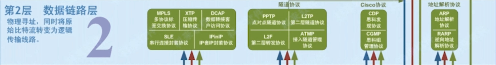
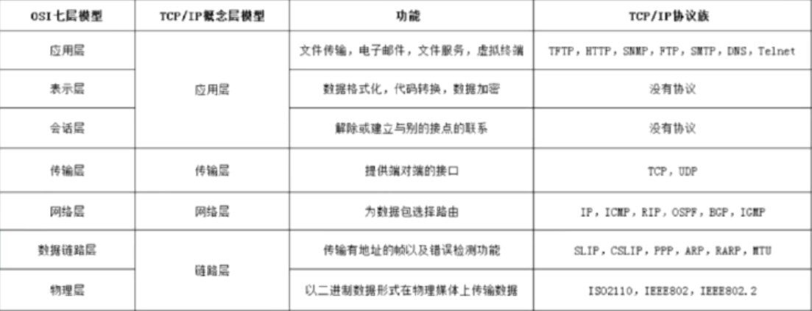

# 七层网络模型 - OSI开放式互联参考模型

七层网络模型不是设计之初就是如此，而是在工程技术不断发展迭代过程中，不断发展而来的

下图为数据在七层网络模型中传输的示意，自下而上的每一层的数据都由描述上次协议的数据mate-data和载荷数据payload组成

## 应用层

5 、6 、7层属于应用层 数据结构根据不同的应用场景和对应的协议不同而改变，没有统一的数据格式

除了图中提到的协议，还有物联网常用的协议：基于TCP的MQTT协议和基于UDP的CoAP协议

> 比如https中的SSL（安全套接字协议），就处在会话层，SSL就是处在http和tcp之间，对http的报文进行加密
>
> RPC框架，都是基于传输层（TCP连接），实现自己的通信协议

## 传输层

> 解决数据量数据的传输，将大块数据分割成一个个等大小的数据包；保证整体数据正确传输 
>
> * 协议：TCP UDP

## 网络层

> 解决路由寻址问题，找到点对点传输中，最优的传输路径（有路由器实现）
>
> * 数据对象：**数据包**

## 链路层

> 解决物理传输过程中，因为硬件问题导致的错传和数据不完整（由交换机实现）
>
> * 数据对象：**帧** 
> * 定义了如何**格式化数据**
>   * 错误检测
>   * 对帧解码，根据帧中的信息，将数据发送到指定的接收方

> 解决两台物理机之间的通讯需求（由网卡实现）
>
> * 数据对象：**比特** 二进制数据（数） -  电流强弱（模） -  二进制数据（数）
> * 定义了物理设备的标志：网线、接口类型

# TCP/IP协议

>TCP/IP（Transmission Control Protocol/Internet Protocol，传输控制协议/网际协议）体系结构是指能够在多个不同网络间实现的协议簇。该协议簇是在美国国防高级研究计划局（Defense Advanced Research Projects Agency，DARPA）所资助的实验性ARPARNET 分组交换网络、无线电分组网络和卫星分组网络上研究开发成功的。网络部分瘫痪时仍保持较强的工作能力和灵活性。这种应用环境导致了一系列协议的出现，从而使不同类型的终端和网络间能够进行有效通信。实际上，Internet已经成为全球计算机互联的主要体系结构，而TCP/IP协议是Internet 的代名词，是将异种网络、不同设备互联起来，进行正常数据通信的格式和大家遵守的约定。

不是TCP协议+IP协议，而是对七层模型一种简化

* 链路层
* 网络层
* 传输层
* 应用层

