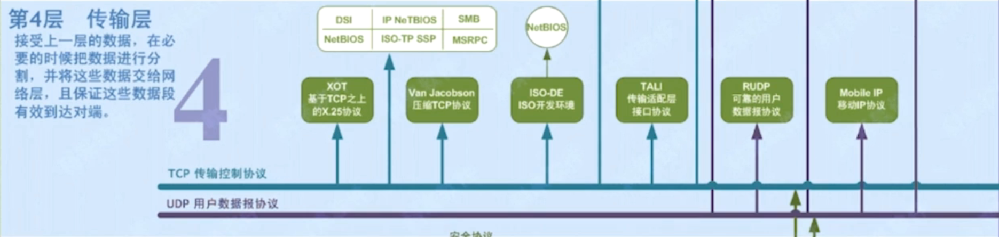

# TCP简介

传输控制协议  Transmission Control Protocol

**面向连接**的、端到端的、**可靠**的、基于**字节流**的**传输层**通信协议

- 面向连接：通过三次握手建立连接
- 端到端：每个网络连接只能从一个IP:port到另一个IP:port

数据传输时，应用层向TCP层发送数据流，将数据流分割成适当长度的**报文段**（报文长度受所在网络限制，数据链路层最大传输单元 MTU，即报文长度由下层基础决定），一个TCP连接中报文段的长度是一定的

将报文段封装成**数据包**，然后将数据包发送给IP层

# 可靠性机制

#### 编号

为了保证数据传输的完整性（避免丢包、错传），每一个数据包都有序号

####  重传 

对方收到该数据包则会发送ACK告诉发送端已收到，发送端超过一段时间内（合理的往返时延 RTT(Round-Trip Time)）没有收到ACK，则会重传

#### 校验 - TCP校验和

CP校验和是一个端到端的校验和，由发送端计算，然后由接收端验证。其目的是为了发现TCP首部和数据在发送端到接收端之间发生的任何改动。如果接收方检测到校验和有差错，则TCP段会被直接丢弃。

TCP校验和覆盖TCP首部和TCP数据，而IP首部中的校验和只覆盖IP的首部，不覆盖IP数据报中的任何数据。

TCP的校验和是必需的，而UDP的校验和是可选的。

TCP和UDP计算校验和时，都要加上一个12字节的伪首部。

# TCP报文

TCP的报文由报文头和payload组成 

## TCP报文头

#### Source Port和Destination Port

源端和接收端进程端口，各占**两个字节**

#### Sequence Number

**序列号**，**发送方**随数据一起发送，用来保证接收方组装数据的顺序性，占**四个字节**

#### Acknowledgment Number

**ACK确认号**，接收方的ACK包（当TCP flags中的A为1）中存在这个值，表示接收端**期望**下一个数据包发来的第一个数据字节的编号，占四个字节（接收端返回确认报文，表示已经成功接收序列号之前的所有字节）

#### Offset

**数据偏移**  可选字段 长度不固定

#### Reserved：保留域

#### TCP Flags

一共占一个字节，使用8个比特位来表示8个boolean值 作为状态标识

##### URG：紧急指针标识

1：有效，0：无效

##### ACK：确认序号表示

Acknowledgment Number字段 1：有效，0：无效

##### PSH：push标志

1：表示接收方接到该报文段立刻将数据交给应用程序，而不是在缓冲区排队

##### RST：重置连接标志

##### SYN：同步序号，用于建立连接过程

SYN=1 ACK=0

##### FIN：finish标志，用于释放连接

#### Window

**滑动窗口**大小，用来控制发送端的发送速率

#### CheckSum

**校验和**，对整个TCP报文段 以16位计算所得，由发送端计算和存储，由接收端验证（再次求和并比对是否相等）

> 目的是为了发现TCP首部和数据在发送端到接收端之间发生的任何改动。如果接收方检测到检验和有差错，则TCP段会被直接丢弃。
