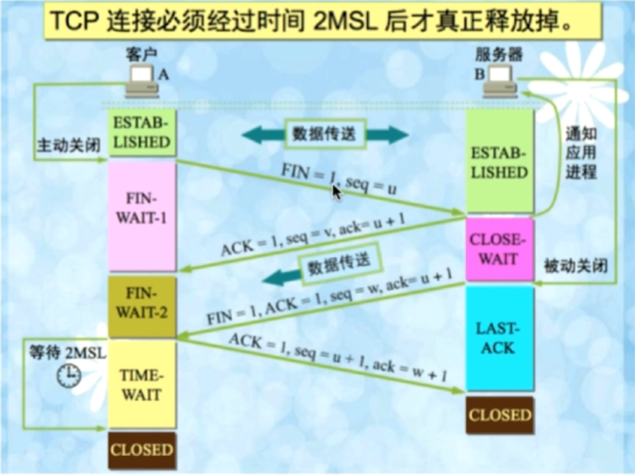

# TCP四次挥手

终止TCP连接，由**客户端或服务端**执行close来触发

#### 第一次挥手 【发起方 ==FIN=> 接收方】

当发起方要关闭连接时，会发送指令告知对方(接收方)，我要关闭连接了

* Client发送一个FIN报文，用来关闭Client到Server的数据传送，Client进入FIN_WAIT_1状态

FIN_WAIT_1状态：等待第一二次握手来回用的时间

> FIN报文中的序列号u = 正文中最后一个数据包的序列号 + 1

#### 第二次挥手 【发起方 <=ACK== 接收方】

接收方收到FIN后会回一个ACK，此时一个发起的数据传输关闭（不是连接）

* Server收到FIN后，发送一个ACK给Client，确认序号为FIN中的序号+1，Server进入CLOSE_WAIT状态

#### 第三次挥手 【发起方 <=FIN== 接收方】

接收方仍然可以继续传输数据，等到**发送完了所有的数据后**，会发送一个FIN段来关闭此方向上的连接

* Server发送一个FIN，用来关闭Server到Client的数据传送，Server进入LAST_ACK状态

#### 第四次挥手【发起方 ==ACK=> 接收方】

发起方收到接收方的FIN后，发送ACK确认关闭连接。

* Client收到FIN后，Client进入TIME_WAIT状态，接着发送一个ACK给Server，确认序号为收到序号+1，Server进入CLOSED状态，完成四次握手

> 注意，接收到FIN报文的一方只能回复一个ACK,它是无法马上返回对方一个FIN报文段的，因为结束数据传输的“指令”是**上层应用层**给出的，我只是一个“搬运工”，我无法了解`“上层的意志”`

# 总结

## TIME_WAIT的作用

* 确保有足够的时间让对方收到ACK包

* 避免新旧连接混淆（重用）

## 为什么需要四次挥手

 因为是全双工，双方都需要FIN报文和ACK报文

## 服务端大量CLOSE_WAIT状态

客户端关闭TCP连接，但服务端的应用程序收到连接关闭信号后，没有想系统发送关闭连接的指令（没有发起第三次挥手）

* 检查代码，特别是**释放资源**的代码
* 检查配置，特别是处理请求的线程配置