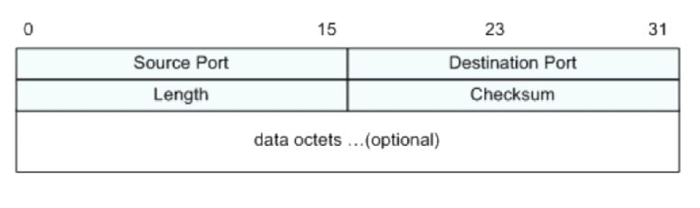

# UDP报文

# 特点

不面向连接

不维护连接状态，支持同时向多个客户端传输相同的数据

报头很短 只有8个字节，额外开销较少 tcp报头则有20个字节

吞吐量只受数据生成数据、传输数据和机器性能影响

主机不需要维持复杂的链接状态表

面向报文 不对报文进行拆分或者合并，不会对上层给的数据进行切分，而是直接交给上层处理

# 区别

连接

#### 连接

tcp是面向连接

udp不是面向连接，用于广播

#### 可靠性

tcp利用握手、确认和重传机制，保证了数据的可达性

udp发送数据包之后不会管接收端是否接收到数据

#### 有序性

tcp利用序列号，保证数据包的顺序交付

udp不具备有序性

#### 传输效率

tcp为了保证数据的可靠性，需要额外的开销：更大的报文头（20字节，udp的报文头为8字节）、维护连接、可靠性检查

udp的传输效率远高于tcp

