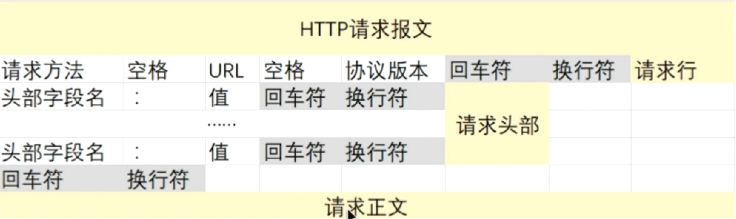
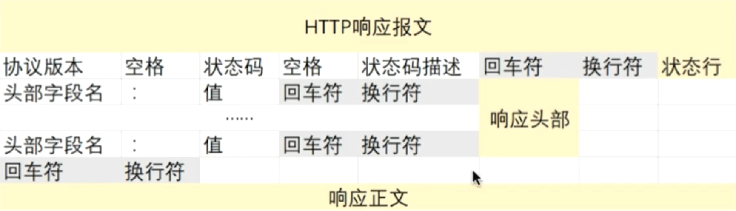
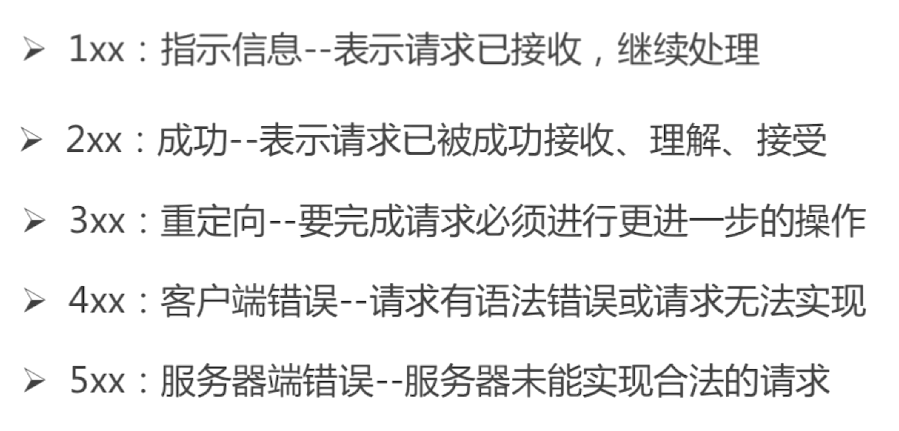
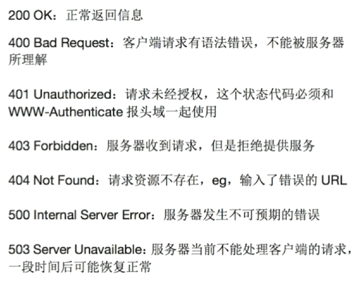

# HTTP

HTTP协议（HyperText Transfer Protocol，超文本传输协议）是用于从WWW服务器传输超文本到本地浏览器的传送协议

#### 版本

> **HTTP 0.9版本　　1991年**
>
> 这个版本就是最初用来向客户端传输HTML页面的，所以只有一个**GET**命令，然后服务器返回客户端一个HTML页面，不能是其他格式

> **HTTP 1.0版本　　1996年**
>
> 1.0版本是改变比较大的，奠定了现在HTTP协议的基础。这个版本的协议不仅可以传输HTML的文本页面，还可以传输其他二进制文件，例如图片、视频。而且还增加了现在常用的POST和HEAD命令。请求消息和响应消息也不是单一的了，规定了一些元数据字段。例如字符集、编码、状态响应码等

> **HTTP 1.1版本　　1997年**
>
> 实际上是在1.0版本之后半年时间又发布了一个版本，这个版本在1.0版本的基础上更加完善。
>
> 这个版本**增加了持久连接**，就是说之前版本的协议一次请求就是一次TCP连接，请求完成后这个连接就关闭掉了。众所周知TCP协议是可靠的，建立连接需要3次握手，断开连接需要4次挥手，并且TCP有流量控制和拥塞控制，有慢开始机制，刚建立连接时传输比较慢，这是比较耗费资源的。一个丰富的页面会有许多图片、表单和超链接。这样的话就会有多次的HTTP请求，所以在这个版本上默认不关闭TCP连接也不用声明Connection:keep-alive字段。如果确实要关闭可以指定Connection: close字段
>
> 还引入了管道机制：在一个TCP连接里可以同时发送多个HTTP请求，而不必等待上一个请求响应成功再发送。还增加了PUT、PATCH、HEAD、OPTIONS、DELETE等命令，丰富了客户端和服务端交互动作。还增加了Host字段。

> HTTP 2版本　　2015年
>
> 这个版本也是随着互联网的发展，有了新的需求制定了新的功能还有对上一个版本的完善。1.1版本有了管道机制，但是正在服务端还是要对请求进行排队处理。这个版本可以多工的处理。还有了头信息压缩和服务器的主动推送

#### 特点

无连接 

无状态

#### 请求报文结构

#### 响应报文结构

# Q&A

### 浏览器访问一个url的流程

**DNS解析**

从近到远，逐层查询，解析url中的域名对应的ip地址

依次是：浏览器》》操作系统》》路由器》》IPS服务器》》域名服务器》》顶级域名服务器

**建立TCP连接**

**发送HTTP请求**

**处理请求并响应**

**浏览器解析响应报文 渲染页面**

**关闭TCP连接**

### HTTP状态码

### GET和POST请求的区别

##### 请求参数的位置

GET请求放在url中，post请求放在报文体中

##### 语义上层面

GET操作具有幂等性和安全性（只有查询操作）

### Cookie和Session

为了解决http无状态连接的问题

**Cookie**将状态信息已文本的形式保存在客户端，在传输过程中，cookie保存在请求头部，也可以在js中对cookie进行操作

**Session**则是将状态信息保存在服务端的内存中，根据请求中的**jsessionId**作为键来查找对应的状态信息 jsessionId可保存在cookie中或者使用url回写

