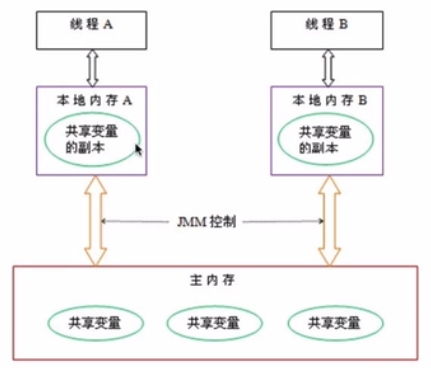
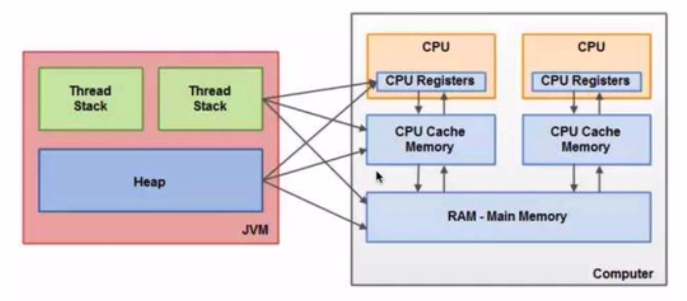
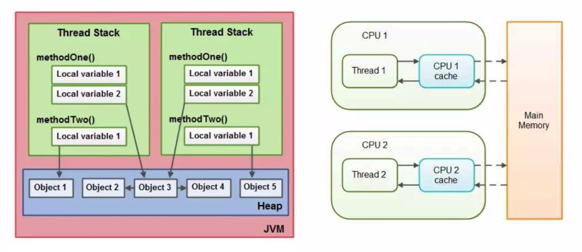

# JMM 内存模型

在**多线程并发访问共享变量**时，规定了**线程**如何和何时可以看到由其他线程对**共享变量**的修改，以及如何同步的访问共享变量

JMM内存模型抽象出主内存、线程本地内存

线程只会操作本地内存中的共享变量的副本，JVM根据JMM规范决定如何将本地内存中的变量同步到主内存中

线程的本地内存之间不可见，通过主内存通信

JVM内存与计算机(CPU-cache-memory)硬件架构的对应关系

