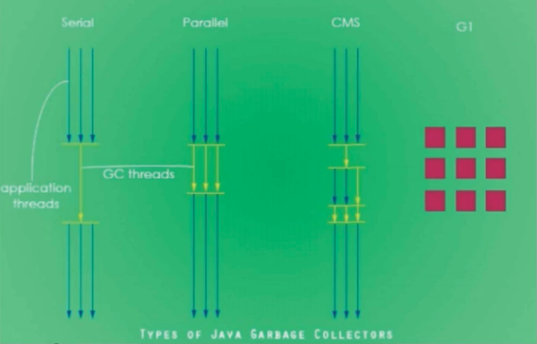
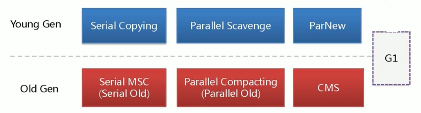
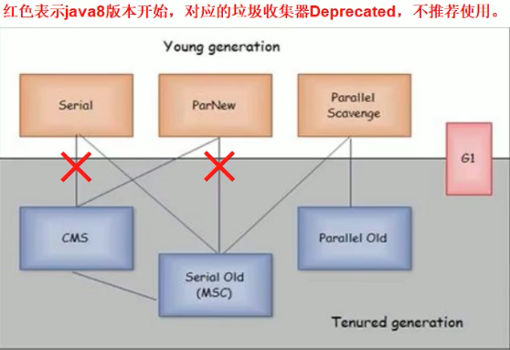
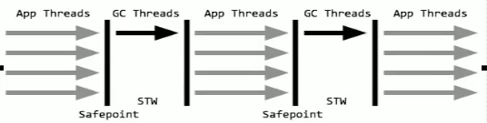
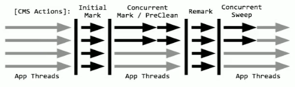
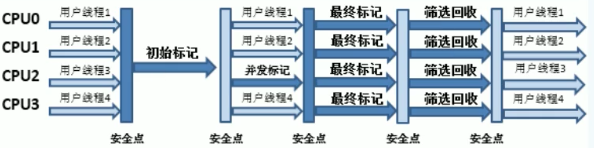

GC发生在堆区，堆通划分为新生代和老年代两个内存区域

# 垃圾判断

## 可达性分析算法

用来在GC时判断对象是否需要回收

在JVM中会设立若干种根对象(GC Roots)，当任何一个根对象到某一个对象均不可达（没有**引用关系**）时，则认为这个对象是可以被回收的

- 方法栈中的局部变量引用

  被正在执行的线程的方法栈中的变量引用

- 静态变量引用

  static声明的类变量，位于方法区中引用

- 软引用和弱引用

## 引用类型

在垃圾判断时，虚拟机根据对象不同的引用类型，执行不同的垃圾回收策略

### 强引用

被强引用的对象，不会被垃圾回收

#### 用法

普通的等号赋值，没有其他修饰

### 软引用 SoftReference

正常情况下垃圾回收是不会回收软引用，**如果垃圾回收之后，内存空间还是不足以存放新的对象，就会把软引用的对象回收**

#### 用法

 ```java
public static SoftReference<Object> ref = new SoftReference<Object>(new Object());
 ```

### 弱引用 WeakReference

发生垃圾回收时，被弱引用的对象和不可达的对象一样，会被垃圾回收

#### 用法

```java
public static WeakReference<Object> ref = new WeakReference<Object>(new Object());
```


# GC类型

## 发生区域划分

### Minor GC

又称为Young GC，发生在堆区新生代

> 为什么Minor GC比Major GC快很多？
>
> 1. 因为新生代中的**大部分对象都是垃圾对象**，所以从GC Roots出发判断是否为垃圾对象的过程非常快
> 2. Minor GC采用复制-清除算法，通过额外的空间（Survivor To区），避免的内存整理，提高了处理速度

#### 触发条件

当新生代**Eden区的内存空间满**，或者不足以分配新的对象，则会触发Minor GC

#### 晋升老年代 promotion条件

##### “年龄”到达阈值

复制一次对象的年龄计数器+1，当年龄计数器到达阈值，会被晋升到老年代
阈值设置参数：`-XX:MaxTenuringThreshold=<N>` 默认阈值为15

##### 动态对象年龄判断

当YoungGC后，Survivor区中的存活对象的总大小超过Survivor区总内存大小的50%，会将“年龄”大于等于**这批对象中最大年龄**的对象移到老年代

##### 超大对象

当需要创建超大的对象，在新生代中没有足够的连续内存来存放

阈值设置参数：`-XX:PretenureSizeThreshold`

##### “幸存”对象大小超过Survivor容量

Minor GC后幸存的对象的总大小大于一个Survivor区的容量，这回把这些对象直接复制到老年代

### Full GC

发生在新生代和老年代中的GC

#### 触发条件

##### 老年代空间不足

- 创建一个大对象，eden区中空间不足，直接保存到老年代中，当老年代空间不足时候

- Survivor对象晋升进入老年代，老年代空间不足
- 统计得到的Minor GC晋升到老年代的平均大小大于老年代的剩余空间

##### G1中老年代占比达到阈值

当老年代占用的Region达到总数的45%（由`-XX:InitatingHeapOccupancyPercent`设置，默认值为45%），会触发一次G1 Mixed GC（针对堆中所有Region的full GC）


# 垃圾回收器

无论是哪种垃圾回收器，在执行清除内存中的垃圾对象步骤时，都会停止系统程序的运行，不让系统程序执行任何代码逻辑，即“Stop the World”。







新生代

- 串行GC Serial
- 并行GC ParNew
- 并行回收GC Parallel Scavenge

老年代

- 

新生代和老年代垃圾搜集器组合



`-XX:UseSerialGC`

- 年轻代：Serial
- 老年代：Serial Old

`-XX:UseParNewGC`  

- 年轻代：ParNew
- 老年代：Serial Old（默认配套的老年代收集器 不推荐）

`-XX:UseConcMarkSweepGC`

- 年轻代：ParNew（默认关联的年轻代垃圾收集器）
- 老年代：CMS+Serial Old（如果CMS失败，会使用Serial Old进行垃圾回收）

`-XX:UseParallelGC`

- 年轻代：Parallel Scavenge
- 老年代：Parallel Old

## Serial GC

`-XX:+UseSerialGC`



它是最古老的垃圾收集器，“Serial”体现在其收集工作是**单线程**的，并且在进行垃圾收集过程中，会进入臭名昭著的“Stop-The-World” 状态。当然，其单线程设计也意味着精简的GC实现，无需维护复杂的数据结构，初始化也简单，所以一直是Client模式下JVM的默认选项。

分为年轻代和老年代的实现：年轻代实现使用的是复制算法；老年代实现单独称作Serial Old，它采用了标记-整理（Mark-Compact）算法

## ParNew GC

新生代GC实现

`-XX:+UseParNewGC`

是Serial GC的**多线程**版本

默认对应的老年代收集器为Serial Old，不推荐使用。最常见的应用场景是配合老年代的CMS GC工作，利用多线程占用更多的计算资源来降低GC对系统带来的卡顿

## Parallel Scavenge GC

新生代GC，绑定老年代使用 Parallel Old GC

`-XX:UseParallelGC`

ParNew的优化版本，添加了2个新特性

- 可控的吞吐量：`thoughtput=用户线程执行时间/(用户线程执行时间+垃圾收集时间)`
- 自适应调节策略：虚拟机会根据当前系统的运行情况收集性能监控信息，动态调节以提供最合适的停顿时间（`-XX:MaxGCPauseMills`）和最大吞吐量

## CMS（Concurrent Mark Sweep） GC

老年代GC算法

> 特点
>
> - 标记-清除 有是碎片
>- 减少"Stop the World"

`-XX:+UseConcMarkSweepGC`

设计目标是**尽量减少停顿时间**，这一点对于Web等反应时间敏感的应用非常重要
但是，CMS基于**标记-清除**（Mark-Sweep）算法，**存在着内存碎片化问题**，为了避免碎片化导致频繁的GC，CMS GC会在垃圾回收完成后，进行一次“Stop the World”，进行内存整理。

> 另外，强调了并发（Concurrent），垃圾回收线程与系统工作线程**尽量同时执行**，所以CMS会占用更多CPU资源，并和用户线程争抢CPU资源。

### 执行过程



#### 初始标记 Initial Mark

会让系统线程全部停止，进入"Stop the World"，标记出所有GC Roots**直接引用**的对象

#### 并发标记 Concurrent Mark

退出"Stop the World"，让系统工作线程继续开始工作，对所有的对象进行GC Roots跟踪，找到老年代中所有被GC Roots引用的对象

在此过程中可能会创建新的存活对象，也可能会有部分存货对象失去引用，变成垃圾对象。垃圾回收线程会尽量的对已有的对象进行**GC Roots追踪**

#### 重新标记 Remark

再次进入"Stop the World"，对并发标记阶段中系统运行**变动过的少数对象**进行标记

#### 并发清理 Concurrent Mark

退出"Stop the World"，开始清理被标记为垃圾的对象

##### Concurrent Mode Failure

`-XX:CMSInitiatingOccupancyFaction` 默认为92% 开启执行CMS GC的

为并发标记过程中可能新加入老年代的对象预留空间

当**并发清理**期间，预留的空间不足以存放下要进入老年代的对象，引发“Concurrent Mode Failure”。会放弃CMS GC，改用Serial Old GC，“Stop the World”之后重新单线程执行一次垃圾回收过程

#### *内存整理

CMS GC采用标记-清除算法，会产生内存碎片。为了防止积累的内存碎片导致Full GC，会定时在CMS GC完成后，对老年代进行整理

使用`-XX:UseCMSCompactAtFullCollection`控制是否开启内存整理，默认情况下开启

使用`-XX:CMSFullGCsBeforeCompaction`控制每执行多少次Full GC 执行一次内存整理。默认是0，表示每次Full GC之后都会进行一次内存整理。

## Parrallel GC

新生代和老年代

`-XX:+UseParallelGC`

在早期JDK 8等版本中，它是server模式JVM的默认GC选择，也被称作是吞吐量优先的GC。它的算法和Serial GC比较相似，尽管实现要复杂的多，其特点是**新生代和老年代GC都是并行进行的**，在常见的服务器环境中更加高效。

## G1 GC

新生代和老年代

`-XX:+UseG1GC`

应用于多处理器和大内存环境，一种兼顾吞吐量和停顿时间的GC实现，是Oracle JDK 9以后的默认GC选项。G1可以**直观的设定停顿时间的目标**（最多可以让系统停顿的时长，默认为200ms，可以通过`-XX:MaxGCPauseMills`设置）

相比于CMS GC，G1未必能做到CMS在最好情况下的延时停顿，但是最差情况要好很多。

### 原理

#### 分制

化整为零的思路，将堆内存拆分成多个大小相等的**Region**，对每一个Region进行跟踪，知道对每一个Region的回收价值。

#### Region

G1收集器将堆内存拆分成多个大小相等的**Region**

Region可以被分配给Eden、Survivor、老年代和大对象专用区，JVM会动态的将Region按需分配给这四种用途

- Eden

- Survivor

- Old

- Humongous

  多个**连续**的region来存放一个大对象


#### 内存分配

##### Region内存大小

设置为G1回收器，默认配置下，每个Region的大小会根据分配堆内存的大小决定，将堆内存平均分成2048个Region

或者可以通过`-XX:G1HeapRegionSize`来指定每个Region的大小

##### 新生代内存分配

G1收集器的内存中**逻辑上**划分了新生代（也有Eden区和Survivor区的概念，比例默认依然是8:1，比如新生代有100个Region，那么Eden占80个，两个Survivor占10个）和老年区

但G1中的内存分配是动态的。初始状态，新生代的region占总体的5%，可以通过`-XX:G1NewSizePercent`来设置新生代的初始占比。

在系统的运行过程中，JVM会不停的给新生代增加更多的Region，但是新生代的占比**不超过60%**，可以通过`-XX:G1MaxNewSizePercent`

##### 老年代

进入老年代的条件

- 对象存活代数（年纪）超过阈值

- 动态年龄判定规则：某次新生代GC后，存活对象中某个存活代数的对象占Survivor中的50%，用这个代数来替代原来的阈值

- 大对象不直接进入老年代，而是G1提供专门的Region来存放大对象

  当对象的大小大于Region大小的50%，会被放入大对象专用的Region中，如果对象太大，可能会横跨多个Region来存放

#### 动态

垃圾回收时不区分年轻代和老年代。G1中堆内存的年轻代和老年代只是逻辑上的概念（某一个region可能现在是用来存放新生代的对象，一段时间之后，被用来存放老年代的对象），新生代不再是固定的大小

#### 回收价值

G1收集器会追踪每一个Region中需要回收的对象大小，以及对这个region进行垃圾回收预计需要多长时间

- 可回收内存大小
- 需要花费的时间

最后在垃圾回收的时候，尽量把垃圾回收对系统造成的影响控制在你指定的时间范围内，同时在有限的时间内尽量回收尽可能多的垃圾对象

#### 复制算法

新生代GC和混合GC都是使用**复制算法**，以region作为最小单位

### GC机制

#### 新生代 GC

与其他垃圾收集器一样，使用Eden区和Survivor区的复制算法进行垃圾回收，只是Eden和Survivor的是由Region组成，大小根据分配动态变化

#### Mixed GC

**不区分新生代和老年代** 对堆内存中的所有Region都进行垃圾回收

将回收的Region里的存活对象复制到其他空闲的Region，然后将在回收的Region清空，成为空闲的Region

根据计算每个Region中的存活对象数量，存活对象的占比，结合执行垃圾回收的预期性能和效率（**回收价值**），执行垃圾回收

垃圾回收时会**停止系统程序**。如果在规定的时间内无法完整的垃圾回收，选择部分Region进行回收，**分多次**进行垃圾回收，将单位时间内的停顿时间控制在设定范围内

考虑预设GC停顿时间，**挑选一部分**Region进行垃圾回收，保证垃圾回收的停顿时间不超过预设时间

##### 执行流程



当老年代占据了堆内存的占比达到`InitatingHeapOccupancyPercent`时触发GC

> 类似于CMS GC，同样使用对线程进行垃圾收集，是CMS的分制版本，并且不会产生内存碎片

- 初始标记

  先停止系统程序的运行，然后根据GC Roots（线程栈内存中的局部变量引用以及方法区中的静态变量引用）标记出被GC Roots**直接引用**的对象为存活对象。

- 并发标记

  这个阶段允许程序允许，同时进行“sub” GC Roots**跟踪**，将初始标记的存活对象所引用的对象也标记为存活对象

- 最终标记

  停止系统程序的运行，根据并发标记阶段记录的那些对象修改，最终标记有哪些存活对象，那些是垃圾对象

- 混合回收

  根据当前内存情况和暂停时间预期，分多次进行Mixed GC，每次对部分Region进行回收
  
- 回收失败 Full GC

  使用复制算法进行垃圾回收时，如果没有足够空闲的Region来存放GC存活的对象，就表示回收失败。会采用单线程进行标记、清理和压缩整理，来清理出空闲的Region

### 相关参数

- `-Xmx` `-Xms`

  每个Region大小与heap的总大小相关

- `-XX:G1HeapRegionSize`

  设置Region的大小

- `-XX:MaxGCPauseMills` 

  设置每次触发一次GC（新生代GC和混合GC）导致的系统停顿（stop the world）的时长，默认值为200毫秒

  > 平衡GC的频率和系统停顿时间
  >
  > 频率太低，会导致一次GC

- `-XX:G1MaxNewSizePercent`

  设置触发新生代垃圾回收的阈值，默认值为60%

- `-XX:InitatingHeapOccupancyPercent`

  设置触发混合垃圾回收的阈值，默认值为45%

  当**老年代**占据了堆内存45%的Region的时候，会尝试触发一次Mixed GC

- `-XX:G1MixedGCCountTarget`

  一次G1 GC最后阶段的混合回收的次数，默认为8次

  > 一次G1 GC可以持续好几个小时

- `-XX:G1HeapWastePercent`

  在Mixed GC过程中，会不断的空出新的Region，空闲的Region达到堆内存的5%（默认值），就会停止本次混合垃圾回收
  
- `-XX:G1MixedGCLiveThresholdPercent`

  默认值为85%，表示确定待回收的Region时，必须满足存活的对象低于整个Region大小的85%

  可以理解成，用来衡量Region的**回收价值**

# GC算法

## 复制算法

> 优点：避免内存碎片化
>
> 缺点：进行复制，既要提前预留内存空间，有一定的**空间浪费**

新生代GC基于复制算法
将Eden和Survivor0（from区域）中存活的对象复制到to区域（survivor1），拷贝过程中将对象顺序放置，就可以避免内存碎片化，提高内存的利用率

## 标记-整理(压缩)算法 Mark-Compact

> 老年代GC算法
>
> 优点：避免内存碎片化
>
> 缺点：效率不高

类似于标记-清除，但为避免内存碎片化，它会在清理过程中**将对象移动**，以确保移动后的对象占用连续的内存空间

## 标记-清除算法 Mark-Sweep

> 老年代GC算法
>
> 优点：效率较高
>
> 缺点：内存碎片化

首先进行标记工作，标识出所有要回收的对象，然后进行清除。

> 这么做除了标记、清除过程效率有限，另外就是不可避免的出现碎片化问题，这就导致其不适合特别大的堆；否则，一旦出现Full GC，暂停时间可能根本无法接受

# GC执行流程

### 动态年龄判定

某次GC过后，JVM发现Survivor区中存活的所有对象占用大小大于Survivor区域的50%时，会统计所有“年龄”对象所占空间大小，按年龄从小到大开始**累加**，当累加的大小超过50%，会将当前计入累加的最大年龄以及大于该年龄的对象移至老年代