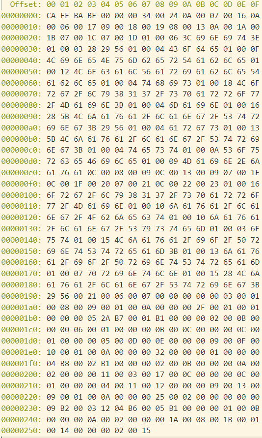

# 编译/反编译命令

`javap <class文件路径>`

`javap -c <class文件路径>`

`javap -verbose <class文件路径>`

# class 字节码文件

Class文件是一组以8位字节为基础单位的二进制流，各个数据项目严格按照顺序紧凑地排列在Class文件之中，中间没有添加任何分隔符，这使得整个Class文件中存储的内容几乎全部是程序运行的必要数据，没有空隙存在。当遇到需要占用8位字节以上空间地数据项时，则会按照高位在前的方式分割成若干个8位字节进行存储。

## 内容

### java源文件

```
public class Main {
    public static void main(String[] args) {
        test();
    }
    public static void test() {
        System.out.println("test");
    }
}
```

### 16进制格式打开

开头的魔法值 CA FE BA BE



- 验证魔法值 Magic Number

  4个字节

  Java 字节码文件的前4个字节固定为 `CA FE BA BE`

- JDK的版本号 Version

  2+2个字节

  - 5,6字节表示minor version
  - 7,8字节表示major version

- 常量池 Constant Pool

  2+n个字节

  从第9个字节开始为常量池，长度不定。由常量池数量和常量池数组构成

  - 常量池数组长度：9,10字节

    **常量池数组中元素的数量 = 常量池数组长度 - 1**

    常量池数组中index为0不计入常量池，是保留常量，对应的null值

    常量池的索引从1而非0开始

  - 常量池数组：从11字节开始

    常量池数组可以由不同的元素类型组成，每种元素的结构可以不同，但每一个元素的第一个字符都是一个u1类型作为类型标识位（tag）
    
    
    
    JVM在解析常量池时，会根据u1类型来获取元素的具体类型

-  访问标志 Access Flags

  2个字节

  表示这个class类的访问权限 public/protected/private

- This Class Name

  2个字节

  表示当前类的名字（引用常量池中的字符）

- Super Class Name

  2个字节

  表示当前类继承的父类（引用常量池的字符）

- Interfaces

  2+n个字节

  表示当前类实现的接口（Object+其他自定义）（引用常量池变量）

- Fields

  2+n个字节

  表示当前类成员变量（this+其他自定义）（引用常量池变量）

- Methods

  2+n个字节

  

- Attributes

  2+n个字节

  类的附加属性

### 反编译 Javap -c 

```
Compiled from "Main.java"
public class org.ly817.sparrow.Main {
  public org.ly817.sparrow.Main();
    Code:
       0: aload_0
       1: invokespecial #1                  // Method java/lang/Object."<init>":()V
       4: return

  public static void main(java.lang.String[]);
    Code:
       0: invokestatic  #2                  // Method test:()V
       3: return

  public static void test();
    Code:
       0: getstatic     #3                  // Field java/lang/System.out:Ljava/io/PrintStream;
       3: ldc           #4                  // String test
       5: invokevirtual #5                  // Method java/io/PrintStream.println:(Ljava/lang/String;)V
       8: return
}
```

### 反编译 冗余信息 Javap -verbose

```
Classfile /C:/workspace/sparrow/sparrow-api/target/classes/org/ly817/sparrow/Main.class
  Last modified 2019-12-13; size 600 bytes
  MD5 checksum 3e9467a4d724a67b0719f5d22036358b
  Compiled from "Main.java"
public class org.ly817.sparrow.Main
  minor version: 0
  major version: 52
  flags: ACC_PUBLIC, ACC_SUPER
Constant pool:
   // 默认构造方法
   // #7  指向方法所属类的描述符（默认构造方法来自java/lang/Object）
   // #22 指向方法名称/类型描述符（构造方法名称为 <init> ）
   #1 = Methodref          #7.#22         // java/lang/Object."<init>":()V
   // test方法
   // #6  指向方法所属类的描述符（org/ly817/sparrow/Main）
   // #23 指向方法名称/类型描述符（test:()V 表示名为test方法 入参为空 返回值为void）
   #2 = Methodref          #6.#23         // org/ly817/sparrow/Main.test:()V 
   // 静态方法的引用
   #3 = Fieldref           #24.#25   // java/lang/System.out:Ljava/io/PrintStream;
   // String作为特殊的对象引用指向utf-8
   // 表示System.out.println("test")中的"test"字符串
   #4 = String             #19            // test
   #5 = Methodref          #26.#27        // java/io/PrintStream.println:(Ljava/lang/String;)V
   // 定义类 指向类限定名常量
   #6 = Class              #28            // org/ly817/sparrow/Main
   // 定义继承接口 指向接口限定名常量
   #7 = Class              #29            // java/lang/Object
   // 常量池中的相关字面量
   #8 = Utf8               <init>
   #9 = Utf8               ()V
  #10 = Utf8               Code
  #11 = Utf8               LineNumberTable
  #12 = Utf8               LocalVariableTable
  #13 = Utf8               this
  #14 = Utf8               Lorg/ly817/sparrow/Main;
  #15 = Utf8               main
  #16 = Utf8               ([Ljava/lang/String;)V
  #17 = Utf8               args
  #18 = Utf8               [Ljava/lang/String;
  #19 = Utf8               test
  #20 = Utf8               SourceFile     // 编译的源文件名
  #21 = Utf8               Main.java      // 源文件名称
  // 字面量的“封装”
  #22 = NameAndType        #8:#9          // "<init>":()V
  #23 = NameAndType        #19:#9         // test:()V
  #24 = Class              #30            // java/lang/System
  #25 = NameAndType        #31:#32        // out:Ljava/io/PrintStream;
  #26 = Class              #33            // java/io/PrintStream
  #27 = NameAndType        #34:#35        // println:(Ljava/lang/String;)V
  // 常量：#6类名
  #28 = Utf8               org/ly817/sparrow/Main
  // 常量：#7接口名
  #29 = Utf8               java/lang/Object
  #30 = Utf8               java/lang/System
  #31 = Utf8               out
  #32 = Utf8               Ljava/io/PrintStream;
  #33 = Utf8               java/io/PrintStream
  #34 = Utf8               println
  #35 = Utf8               (Ljava/lang/String;)V
{
  public org.ly817.sparrow.Main();
    descriptor: ()V
    flags: ACC_PUBLIC
    Code:
      stack=1, locals=1, args_size=1
         0: aload_0
         1: invokespecial #1                  // Method java/lang/Object."<init>":()V
         4: return
      LineNumberTable:
        line 11: 0
      LocalVariableTable:
        Start  Length  Slot  Name   Signature
            0       5     0  this   Lorg/ly817/sparrow/Main;

  public static void main(java.lang.String[]);
    descriptor: ([Ljava/lang/String;)V
    flags: ACC_PUBLIC, ACC_STATIC
    Code:
      stack=0, locals=1, args_size=1
         0: invokestatic  #2                  // Method test:()V
         3: return
      LineNumberTable:
        line 17: 0
        line 23: 3
      LocalVariableTable:
        Start  Length  Slot  Name   Signature
            0       4     0  args   [Ljava/lang/String;

  public static void test();
    descriptor: ()V
    flags: ACC_PUBLIC, ACC_STATIC
    Code:
      stack=2, locals=0, args_size=0
         0: getstatic     #3                  // Field java/lang/System.out:Ljava/io/PrintStream;
         3: ldc           #4                  // String test
         5: invokevirtual #5                  // Method java/io/PrintStream.println:(Ljava/lang/String;)V
         8: return
      LineNumberTable:
        line 26: 0
        line 27: 8
}
SourceFile: "Main.java"
```

## 文件结构

这种数据结构，类似C语言结构体。这个结构体中只有两种数据类型：**无符号数**和**表**，后面的解析都要以这两种数据类型为基础

```
ClassFile {
    u4 magic;
    u2 minor_version;
    u2 major_version;
    u2 constant_pool_count;
    cp_info constant_pool[constant_pool_count-1];
    u2 access_flags;
    u2 this_class;
    u2 super_class;
    u2 interfaces_count;
    u2 interfaces[interfaces_count];
    u2 fields_count;
    field_info fields[fields_count];
    u2 methods_count;
    method_info methods[methods_count];
    u2 attributes_count;
    attribute_info attributes[attributes_count];
}
```

### 无符号数

无符号数属于基本的数据类型，以u1，u2，u4，u8来分别代表1个字节，2个字节，4个字节和8个字节的无符号数，无符号数可以用来描述数字、索引引用、数量值或者按照UTF-8编码构成字符串值。

### 表

表是由多个无符号数或者其他表作为数据项构成的复合数据类型，所有表都习惯性地以“ _info”结尾。表用于描述有层次关系的复合结构的数据，整个Class文件本质就是一张表。 

## 关键数据类型

### 常量池 Constant pool

Java类中定义的很多信息都是由常量池来维护或描述

#### 数据类型

常量池中主要存储两类数据结构：**字面量**和**符号引用**

##### 字面量

包含bytes，保存实际数据


- 文本字符串
- 声明为**final**的常量值

##### 符号引用

包含index引用指针，指向其他符号引用或者字面量


- 类与接口的全局限定名
- 字段的名称和描述符
- 方法的名称和描述符

> 包含tag和**引用指针**，最终通过指向


- 类中定义的方法和变量信息
- 

> 可以把常量池作为Class文件的“资源仓库”，会通过index应用常量池中的常量信息

#### 描述信息

JVM规范中，每个变量、字段、方法都有描述信息，用来描述数据类型、方法的参数列表（包括数量、类型与顺序）与返回值。

描述信息**不包括变量或者方法的名称**

##### 变量描述符

根据描述符规则，**基本数据类型**和代表无返回值的**void类型**都用一个大写字母来表示；对象类型则使用字符L+类的全限定名来表示；（为了压缩字节码文件的体积）

- B - byte
- C - char
- D - double
- F - float
- I - int
- J - long
- S - short
- Z- boolean
- V - void
- Lxxx/xxx/xxx - 对象类型 如 `Ljava/lang/String`

##### 数组

对于数组类型而言，每一个维度使用一个`[`来表示

> `int[]`被记为`[I`；`String[][]`被记为`[[Ljava/lang/String`

##### 方法描述符

用描述符描述方法时，按照`(参数列表) 返回值`的顺序来描述，参数列表按照参数的严格顺序放在一组`()`中

> `String getName(int id,String code)`的描述符为
>
> `(I,Ljava/lang/String;) Ljava/lang/String`

### Code

#### 行号表 LineNumberTable

#### 局部变量表 LocalVariableTable

