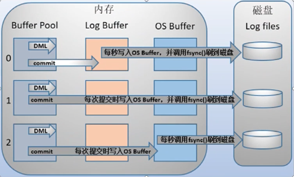

## 常见引擎

### InnoDB

- 适用场景
  - 大多数OLTP场景
- **事务型** 支持ACID
  - 不能混合使用事务和非事务存储引擎
  - begin transaction -- commit
- 存储实现：数据按**主键**聚集存储（**聚集索引**）
  - 必须有主键
  - 其他索引都指向主键，然后进行二次寻址
    - 主键索引 >> 行数据
    - 其他所有 >> 主键索引
- 存储文件：表和索引信息在一个文件中
  - IDB：存储表和索引
  - frm：8.0之后 移除
- 支持行级锁及MVCC
  - 行级锁提高并发性能
  - MVCC：可以并发进行读操作和写操作
  - 支持for udpate
- 支持Btree和自适应Hash索引，支持全文和空间索引
  - Hash索引只使用于等值查询

### MyISAM

Indexed Sequential Access Method

- 适用场景
  - **读操作远大于写操作**的场景
  - 不需要事务

- **非事务型**
- 存储实现：以堆表进行存储 **查询性能好**于innodb
  - **快速读取**：索引的叶子节点**直接指向**的是数据存储的实际位置
    - MYI 中存放的是 索引-数据行物理存储地址的键值对
  - 修改性能差：每次写操作都要维护数据和索引信息
    - 数据越多，写操作效率越低
    - 索引越多，效率越低
- 存储文件：由两个文件组成，分布存储数据和索引
  - MYD 数据
  - MYI 索引
  - frm：表结构信息 8.0之后被删除
- 缺点
  - 不支持事务和**外键**
  - 不能容错 需要经常备份
    - 不能在表损坏（表信息）后恢复数据
    - 磁盘崩溃可以使用工具（MyISAMCHK）来修复数据
  - 占用空间（表格锁定机制优化并发的读写操作）
    - 需要定时使用MyISAMPACK来清理空间
- 使用**表级锁** 读写操作相互阻塞
- 索引
  - Btree
  - 空间索引
  - 全文索引

### CSV

- 适用场景
  - 作为数据交换的中间表使用
    - csv格式文件的通用性
- 非事务型存储引擎
- 所有列必须为**非空**
- 不支持索引
- 文件存储：以CSV文件存储

### Archive

- 适用场景
  - 日志类或数据采集类
  - 数据归档
- 非事务型存储引擎
- 表数据使用zlib进行压缩 **节约空间**
- 只支持insert和select
- 只运行在自增ID上建索引

### Memory

- 适用场景
  - 缓存字典映射表
  - 缓存周期性分析数据
- 非事务型存储引擎
- 数据保存在**内存**中
  - 重启会丢失
  - 没有磁盘io，读取性能好
- 所有字段长度固定
- 支持Btree和Hash索引

# InnoDB

事务

## InnoDB数据页

> 局部性原理：当访问某一条数据时，之后有很大概率访问该条数据附近数据

数据页是InnoDB存储数据的基本单元

`Innodb_page_size` 分页大小 一次从文件系统读取的大小 默认为16kb 

## InnoDB事务特性实现

> 原来的MyISAM没有crash-safe能力，事务执行中服务崩溃对导致数据不一致
>
> mysql自带的binlog只用用于归档，没有crash-safe能力；InnoDB使用另外一套日志系统来保证服务崩溃后能恢复数据的一致性

#### 回滚日志 Undo log 【原子性】

记录数据修改前的状态

> 用于事务出现异常回滚到原来状态

#### 重做日志 Redo log 【一致性】

用于记录修改后的状态（sql执行结果，存在于缓存中，还未写入到磁盘）

>  `innodb_flush_log_at_trx_commit` 
>
> InnoDB刷盘策略（类似RocketMQ的同步刷盘和异步刷盘）
>
> 0：log buffer将每秒一次地写入log file中，并且log file的flush(刷到磁盘)操作同时进行。该模式下在事务提交的时候，不会主动触发写入磁盘的操作。
>
> 1：**每次事务提交**时MySQL都会把log buffer的数据写入log file，并且flush(刷到磁盘)中去，该模式为系统默认。
>
> 2：每次事务提交时MySQL都会把log buffer的数据写入log file，但是flush(刷到磁盘)操作并不会同时进行。该模式下，MySQL会每秒执行一次 flush(刷到磁盘)操作。
>
> - 1不会丢失数据 但是性能最差
>
> -  0、2先写入到系统缓存中，每隔一秒批量写入磁盘，提高io效率
>
>   如果断电或者宕机会丢失这一秒内的数据

#### 锁 【隔离性】

用来做资源隔离，让对数据的读写有顺序

分为共享锁和排他锁

数据**查询**需要对资源加**共享锁**（S）

> 保证**读取过程**中不会被其他事务修改

数据**修改**需要对资源加**排他锁**（x）

> 保证事务在修改数据过程中，不会被其他事务读到或者修改

#### MVCC 多版本并发控制

在innodb中，当一个事务（A）对数据进行修改时，另一个事务（B）还是可以读到被A上了**排他锁**的值（但是看不到A未提交的修改）

利用到undo log，实际上是读取事务Aundo log中，数据修改的值

#### Undo + Redo 【持久性】