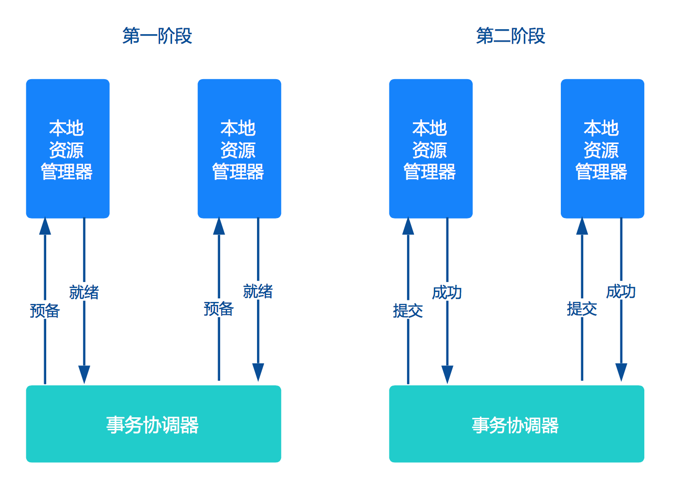

事务是**一组**数据操作处理的动作集合，事务具备

一组处理步骤或者全部发生或者一步也不执行，我们称该组处理步骤为一个事务。

* 提交：当所有的步骤像一个操作一样被完整地执行，我们称该事务被提交。

* 回滚：由于其中的一部分或多步执行失败，导致没有步骤被提交，则事务必须回滚到最初的系统状态。

# 本地事务

在单体系统中，可以通过本地事务来保证事务的完整性

### SQL事务

以MySQL为例简要说明

* `BEGIN` 来开启一个事务
* `ROLLBACK` 事务回滚
*  事务提交

### Spring事务支持

为方法添加`@Transactional`注解，**利用AOP**

* 为方法中所有数据库操作开启事务 `begin`
* 当方法执行出现指定异常时，执行事务回滚 `ROLLBACK` 
* 当方法正常执行完毕后，将事务提交 `COMMIT`

# 分布式事务

分布式系统中，一个事务中的执行步骤分布在不同进程中，数据保存在不同的数据库中，无法使用上述的本地事务

## 分布式基本理论

### CAP

CAP，Consistency-Availability-Partition tolerance 的简写：

- **Consistency：**一致性，对某个客户端来说，读操作能够返回最新的写操作结果
- **Availability：**可用性，非故障节点在合理的时间内返回合理的响应
- **Partition tolerance：**分区容错性，当出现网络分区后，系统能够继续提供服务

> 在分布式系统中，无法保证网络做到 100% 的可靠，所以网络分区问题一定存在（分区之间数据同步失败）；
>
> 在进行分布式系统设计时，必须保证分区容错性（P）,CAP不能同时满足，必须在C和A中做取舍
>
> * CP架构（强一致性）
>
>   当出现网络分区后，为了保证一致性，必须停止对外提供服务；直到网络恢复，各分布式系统数据同步达到一致，再恢复对外提供服务
>
> * AP架构（高可用性）
>
>   当出现网络分区后，保证服务的高可用性，任然会对外提供服务，但不能保证返回的数据是最新的

### BASE

基本可用 Basically Available，软状态 Soft State，最终一致性 Eventual Consistency

核心思想是即便无法做到强一致性，但应该采用适合的方式保证最终一致性

## 资源管理器实现

DBMS数据库厂商按协议提供接口，实现分布式事务

> MySQL从5.5版本开始支持，SQL Server 2005 开始支持，Oracle 7 开始支持

### 协议

#### TX协议

应用或者应用服务器与事务管理器的接口。

#### XA协议

> 由X/Open DTP组织（X/Open DTP group）定义的两阶段提交协议

全局事务管理器与资源管理器的接口：由X/Open组织提出的分布式事务规范。该规范主要定义了全局事务管理器和局部资源管理器之间的接口。

> XA接口是一个双向的系统接口，在事务管理器以及多个资源管理器之间作为通信桥梁。
>
> 之所以需要XA是因为在分布式系统中从理论上讲两台机器是无法永远处于一致性状态。因此引入一个单点进行协调（全局事务管理器）。
>
> 由全局事务管理器管理和协调的事务可以跨越多个资源和进程。全局事务管理器一般使用XA二阶段协议与数据库进行交互。

##### 角色

·

###### AP 应用程序

应用程序，可以理解为使用DTP（Data Tools Platform）的程序

###### RM （局部）资源管理器

资源管理器，这里可以是一个DBMS（数据库）或者消息服务器管理系统，应用程序通过资源管理器对资源进行控制，资源必须实现XA定义的接口。资源管理器负责控制和管理实际的资源

###### TM （全局）事务管理器

事务管理器，负责协调和管理事务，提供给AP编程接口以及管理资源管理器。事务管理器控制着全局事务，管理事务的生命周期，并且协调资源

> 将分布在所有资源节点的状态，集中到一个内存中进行管理

#### 2PC 两阶段提交协议

> Two-phase Commit：Oracle的两阶段提交协议

XA用于在全局事务中协调多个资源的机制。**TM和RM之间采取两阶段提交的方案来解决一致性问题**。

两阶段提交需要一个协调者（TM）来掌控所有参与者（RM）节点的操作结果并且指引这些节点是否需要最终提交。两阶段提交的局限在于协议成本，准备阶段的持久成本，全局事务状态的持久成本，潜在故障点多带来的脆弱性，准备后，提交前的故障引发一系列隔离与恢复难题

协调器（使用分布式锁的思想：在一个公共内存中维护共有资源的占用状态）和若干事务执行者（分布式服务实例）两种角色

- 第一阶段是**表决阶段**，所有参与者都将本事务能否成功的信息反馈发给协调器；

  > 事务协调器要求每个涉及到事务的数据库预提交(precommit)此操作到TM，并反馈是否可以提交

- 第二阶段是**执行阶段**，协调者根据所有参与者的反馈，通知所有参与者，步调一致地在所有分支上提交或者回滚。

## 服务端实现

在服务端维护分布式事务

### 特点

#### 柔性事务

柔性状态是指**允许**系统存在**中间状态**，这个中间状态不会影响系统整体的可用性

> 比如数据库读写分离的主从同步延迟等

柔性事务的一致性指的是最终一致性

分布式事务需要具备以下特点

#### 操作可查询

每一个服务操作都被存储为dolog，具有全局唯一的标识，操作唯一的确定的时间，可以被查询。

#### 可补偿操作

Do阶段：真正的执行业务处理，业务处理结果外部可见。

Compensate（补偿 redo）阶段：抵消或者部分撤销正向业务操作的业务结果，补偿操作满足幂等性。

> 约束：补偿操作在业务上可行，由于业务执行结果未隔离或者补偿不完整带来的风险与成本可控。实际上，TCC的Confirm和Cancel操作可以看做是补偿操作。

#### 幂等操作

重复调用多次产生的业务结果与调用一次产生的结果相同。一是通过业务操作实现幂等性，二是系统缓存所有请求与处理的结果，最后是检测到重复请求之后，自动返回之前的处理结果。

### 2PC 两阶段提交

参与者将操作成败通知协调者，再由协调者根据所有参与者的反馈情报决定各参与者是否要提交操作还是中止操作

- 预提交：在一个公共的事务管理器汇总不同业务操作的执行状态；

- 确认提交：汇总一个事务包含的所有业务操作的预提交结果
  - 如果全部执行完成，则通知所有业务提交操作结果
  - 如果存在执行异常，则通知所有业务将之前的操作回滚

#### 实现

二阶段提交算法的成立基于以下假设：

- 该分布式系统中，存在一个节点作为协调者（Coordinator），其他节点作为参与者（Cohorts）。且节点之间可以进行网络通信。
- 所有节点都采用预写式日志，且日志被写入后即被保持在可靠的存储设备上，即使节点损坏不会导致日志数据的消失。
- 所有节点不会永久性损坏，即使损坏后仍然可以恢复。

> ##### 优点
>
> - 一定程度上能保证数据的强一致性
>
> ##### 缺点
>
> - **阻塞**：2.1在等待事务其他参与者预提交时，处于阻塞状态
>
> - 单点故障：一旦协调者发生故障，参与者会一直阻塞，尤其是在第二阶段，协调者发生故障，那么所有的参与者都处于锁定事务资源的状态中，而无法继续完成事务操作

### TCC 补偿事务

TCC方案其实是两阶段提交的一种改进。其将整个业务逻辑的每个分支显式的分成了Try、Confirm、Cancel三个操作。

> 核心思想：针对与事务相关的每个操作，都要注册一个与其对应的确认提交（Confirm）和补偿（Cancel）操作。
>
> TCC属于应用层的一种**补偿方式**，所以需要程序员在实现的时候多写很多补偿的代码，在一些场景中，一些业务流程可能用TCC不太好定义及处理

Try部分完成业务的准备工作，confirm部分完成业务的提交，cancel部分完成事务的回滚

- Try阶段：尝试执行业务，对业务系统做检测及资源预留

- Confirm阶段：真正的去执行业务，不做任何检查，仅适用Try阶段预留的业务资源，Confirm操作还要**满足幂等性**

  > Try阶段执行成功并开始执行 Confirm阶段时，默认 Confirm阶段是不会出错的。即：只要Try成功，Confirm一定成功

- Cancel阶段：取消执行业务，释放Try阶段预留的业务资源，Cancel操作要**满足幂等性**

> TCC与2PC(两阶段提交)协议
>
> 区别：TCC位于业务服务层而不是资源层，TCC没有单独准备阶段，Try操作兼备资源操作与准备的能力，TCC中Try操作可以灵活的选择业务资源，锁定粒度。TCC的开发成本比2PC高。实际上TCC也属于两阶段操作，但是TCC不等同于2PC操作。
>
> 缺点：性能太差，两阶段提交涉及多次节点间的网络通信，通信时间太长； 事务时间相对于变长了，锁定的资源的时间也变长了，造成资源等待时间也增加好多。

---

### 基于消息队列

将分布式事务拆分成本地事务进行处理，通过消息来测试

#### RocketMQ事务消息

RocketMQ中提供事务消息 prepare(half) message

- 开始事务：发送一个事务消息，对于其他消息消费者不可见
- 执行本地事务A：执行业务逻辑（`TransactionListener.executeLocalTransaction`）
  - **执行成功**：修改事务消息的状态（返回`LocalTransactionState.COMMIT_MESSAGE`），使其对执行事务后续操作的消费者可见
  - **执行失败**：删除之前发送的事务消息（返回`LocalTransactionState.ROLLBACK_MESSAGE`）
  - **回查**：当发送broker的half message没有收到LocalTransactionState返回值时，broker会回调（`TransactionListener.checkLocalTransaction`）
- 消息消费者消费到事务消息，表示本地事务A执行成功，开始执行本地事务B
- 重复事务A的事务消息操作...

最终保证事务链中所有本地事务的顺序执行

#### 可靠消息服务

> 对不支持事务的MQ进行封装

业务处理服务在业务事务提交之前，向实时消息服务请求发送消息，实时消息服务只记录消息数据，而不是真正的发送。业务处理服务在业务事务提交之后，向实时消息服务确认发送。只有在得到确认发送指令后，实时消息服务才会真正发送。

# 参考

https://www.jianshu.com/p/cc5c10221aa1

https://www.cnblogs.com/jiangyu666/p/8522547.html

https://www.cnblogs.com/bluemiaomiao/p/11216380.html
