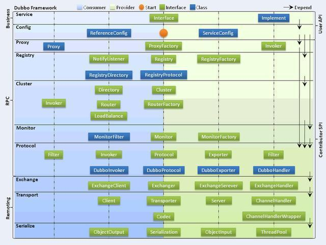
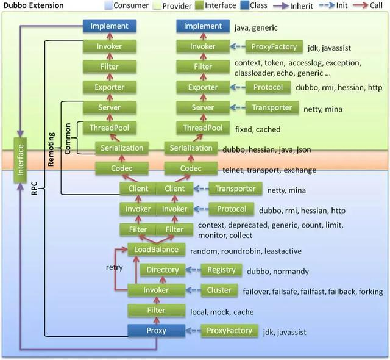

Dubbo 作为RPC服务框架

包含3个核心功能

- Remoting 网络通信框架

- Cluster 集群管理
- Registry 服务注册与发现

## 架构分层

- 服务接口层（Service）

  该层是与实际业务逻辑相关的，根据服务提供方和服务消费方的业务设计对应的接口和实现；

- 配置层（Config）

  对外暴露的配置接口

  服务提供方ServiceConfig和服务调用方ReferenceConfig

- 服务代理层（Proxy）

  服务接口透明代理，生成服务的客户端Stub和服务器端Skeleton

  服务端创建invoker 调用Service层的接口实现

  客户端创建动态代理对象proxy，封装下层远程调用，为用户提供可以调用的API对象

- 服务注册层（Registry）

  封装服务地址的注册与发现，以服务URL为中心的服务元数据

  不同形式的注册中心实现，如zookeeper、redis、nacos、组播

- 集群层（Cluster）

  服务调用方实现基于客户端的负载均衡

  本地维护注册列表，通过不同的负载均衡规则，实现不同的负载均衡策略

- 监控层（Monitor）

  RPC调用次数和调用时间监控

- 远程调用层（Protocol）

  封装RPC调用

- 信息交换层（Exchange）

  封装请求响应模式

  同步转异步，以Request和Response为中心

- 网络传输层（Transport）

  底层网络通信实现

  抽象mina和netty为统一接口

## 调用流程

下图表示一次rpc调用不同模块之间调用过程

标注了各个模块不同SPI实现

