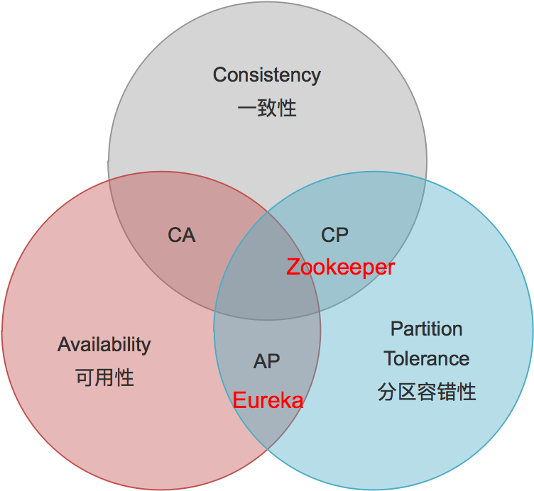

# CAP理论

> 网络波动和硬件节点宕机无法避免，现实情况下我们面对的是一个不可靠的网络、有一定概率宕机的设备，这两个因素都会导致Partition，因而分布式系统实现中 P 是一个必须项，而不是可选项。只能在AC之中做取舍

# SpringCloud

## 版本

### 命名

Spring Cloud的大版本名称为伦敦地铁站名，按字母A-Z顺序

#### 主版本号

下列为常用SpringCloud主版本号以及对应SpringBoot版本的对应关系

* Hoxton - 2.2.x
* Greenwich - 2.1.x
* Finchley - 2.0.x
* Edgware - 1.5.x
* Dalston - 1.5.x

因为Spring Cloud是一组子项目的集合，为了区别于子项目语义化的版本号（如`2.0.0.RELEASE`）

#### 子版本号

- SNAPSHOT： 快照版本，随时可能修改
- M(Milestone):PRE 表示预览版
- RELEASE:第一个正式发布版
- SR (Service Release):基于正式发布版的bug修复发布版本
- GA(GenerallyAvailable)：表示稳定版本

下表为[SpringCloud官方说明](https://spring.io/projects/spring-cloud#overview)给出的对应关系

| Component                 | Edgware.SR6    | Greenwich.SR2 | Greenwich.BUILD-SNAPSHOT |
| ------------------------- | -------------- | ------------- | ------------------------ |
| spring-cloud-aws          | 1.2.4.RELEASE  | 2.1.2.RELEASE | 2.1.3.BUILD-SNAPSHOT     |
| spring-cloud-bus          | 1.3.4.RELEASE  | 2.1.2.RELEASE | 2.1.3.BUILD-SNAPSHOT     |
| spring-cloud-cli          | 1.4.1.RELEASE  | 2.0.0.RELEASE | 2.0.1.BUILD-SNAPSHOT     |
| spring-cloud-commons      | 1.3.6.RELEASE  | 2.1.2.RELEASE | 2.1.3.BUILD-SNAPSHOT     |
| spring-cloud-contract     | 1.2.7.RELEASE  | 2.1.2.RELEASE | 2.1.3.BUILD-SNAPSHOT     |
| spring-cloud-config       | 1.4.7.RELEASE  | 2.1.3.RELEASE | 2.1.4.BUILD-SNAPSHOT     |
| spring-cloud-netflix      | 1.4.7.RELEASE  | 2.1.2.RELEASE | 2.1.3.BUILD-SNAPSHOT     |
| spring-cloud-security     | 1.2.4.RELEASE  | 2.1.3.RELEASE | 2.1.4.BUILD-SNAPSHOT     |
| spring-cloud-cloudfoundry | 1.1.3.RELEASE  | 2.1.2.RELEASE | 2.1.3.BUILD-SNAPSHOT     |
| spring-cloud-consul       | 1.3.6.RELEASE  | 2.1.2.RELEASE | 2.1.3.BUILD-SNAPSHOT     |
| spring-cloud-sleuth       | 1.3.6.RELEASE  | 2.1.1.RELEASE | 2.1.2.BUILD-SNAPSHOT     |
| spring-cloud-stream       | Ditmars.SR5    | Fishtown.SR3  | Fishtown.BUILD-SNAPSHOT  |
| spring-cloud-zookeeper    | 1.2.3.RELEASE  | 2.1.2.RELEASE | 2.1.3.BUILD-SNAPSHOT     |
| spring-boot               | 1.5.21.RELEASE | 2.1.5.RELEASE | 2.1.8.BUILD-SNAPSHOT     |
| spring-cloud-task         | 1.2.4.RELEASE  | 2.1.2.RELEASE | 2.1.3.BUILD-SNAPSHOT     |
| spring-cloud-vault        | 1.1.3.RELEASE  | 2.1.2.RELEASE | 2.1.3.BUILD-SNAPSHOT     |
| spring-cloud-gateway      | 1.0.3.RELEASE  | 2.1.2.RELEASE | 2.1.3.BUILD-SNAPSHOT     |
| spring-cloud-openfeign    |                | 2.1.2.RELEASE | 2.1.3.BUILD-SNAPSHOT     |
| spring-cloud-function     | 1.0.2.RELEASE  | 2.0.2.RELEASE | 2.0.3.BUILD-SNAPSHOT     |

> 语义化的版本控制 `a.b.c.xxxx`
>
> - `a`：主版本号，有大的修动，会导致版本不兼容
> - `b`：次版本号，一些功能的新增，但整体架构上没有太大的变化，可以与之前的次版本兼容
> - `c`：增量版本，bug修复
> - `xxxx`：里程碑 `SNAPSHOT`:开发版、`M`:里程碑、 `RELEASE`：正式版

### 配置

SpringCloud没有自己的实现，主要作用

- 定义接口和实现规范
- 通过maven配置来维护与各子模块的版本的对应关系

### 子系统命名规则

`spring-cloud-starter-{子项目名称}[-{模块名称}]`

## 规范

> Spring Cloud focuses on providing good out of box experience for typical use cases and extensibility mechanism to cover others.
>
> Spring Cloud致力于提供以下功能开箱即用体验以及可扩展到其他功能的机制
>
> - Distributed/versioned configuration 配置管理
> - Service registration and discovery 服务注册与发现
> - Routing 路由
> - Service-to-service calls 服务调用
> - Load balancing 负载均衡
> - Circuit Breakers 短路保护
> - Global locks 全局锁机制
> - Leadership election and cluster state 集群选举
> - Distributed messaging 分布式消息

微服务公共关注点，不同的厂商根据SpringCloud提供的规范提供实现，如Netflix和Alibaba

### 服务发现和负载均衡

在`spring-cloud-commons`项目中的**org.springframework.cloud.client**包

### 弹性和容错

### API管理

通过网关来实现，管理对外暴露API

- 方向路由
- 安全鉴权
- 访问日志记录
- 限流
- AB测试
- 灰度发布

### 配置管理

### 监控

#### 日志管理监控

#### Metrics监控

#### 调用链监控

微服务落地存在的问题

- 单体应用拆分为分布式系统后，进程间的通讯机制和故障处理措施变的更加复杂。

- 系统微服务化后，一个看似简单的功能，内部可能需要调用多个服务并操作多个数据库实现，服务调用的分布式事务问题变的非常突出。

- 微服务数量众多，其测试、部署、监控等都变的更加困难。

