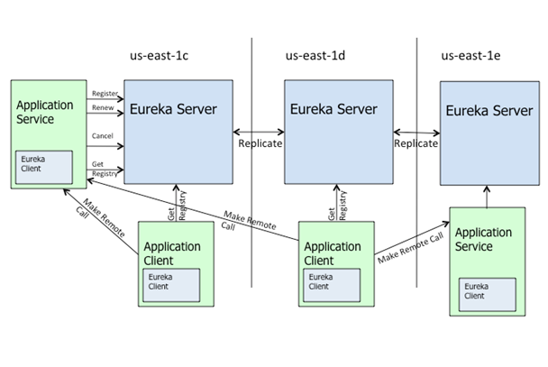

# 概述与配置

Eureka 是 Netflix 的一个子模块，也是核心模块之一，是SpringCloud的默认服务发现组件。

Eureka 是一个基于 REST（Representational State Transfer） 的服务，用于**定位服务**，以实现云端中间层服务发现和故障转移。

> 类似DNS服务，只需要通过服务名就能访问到对应服务，不需要关注IP端口

一方面给内部服务做服务发现（Eureka Server），另一方面可以结合ribbon组件提供各种个性化的负载均衡算法（Eureka Client）

> Eureka属于客户端发现模式，客户端从一个服务注册服务中查询所有可用服务实例的库，并缓存到本地。客户端负责决定相应服务实例的网络位置，并且对请求实现负载均衡。

## 基本架构

集群部署的 Eureka 架构图

- Eureka Server：Eureka 服务端，多个 Eureka Server 可构成集群，集群中各节点**完全对等**。
- Eureka Client：Eureka 客户端，业务服务依赖它实现服务注册和服务发现功能。
  - Application Service：服务提供者，依赖 Eureka Client 实现服务注册功能。
  - Application Client：服务消费者，依赖 Eureka Client 实现服务发现功能。
  - 一个应用Application可以**同时**是服务的**提供者和消费者**
- Register：Eureka Client 启动时会发起 Register 请求向 Eureka Server 注册自己。
- Renew：Eureka Client 会周期性的向 Eureka Server 发送心跳来续约，默认30s。
- Cancel：Eureka Client 关闭时会发送 Cancel 下线请求。
- Get：Eureka Client 会周期性的发送 Get 请求，从 Eureka Server 拉取注册表信息缓存到本地，默认30s。
- Make Remote Call：服务消费者对服务提供者进行远程调用（基于http）
- Replicate：Eureka Server 之间通过 Replicate 实现**数据同步**。当 Eureka Client  有请求（Heartbeat, Register, Cancel, StatusUpdate, DeleteStatusOverride）到某一个  Eureka Server 节点，该节点完成自身对应的操作后，会通过 Replicate 将本次请求同步到其他节点。

### Eureka Server 注册中心

##### 对外提供功能

- **服务注册**
  服务提供者启动时，会通过 Eureka Client 向 Eureka Server 注册信息，Eureka Server 会存储该服务的信息，Eureka Server 内部有二层缓存机制来维护整个注册表
- **提供获取最新注册表**
  服务消费者在调用服务时，如果 Eureka Client 没有缓存注册表的话，会从 Eureka Server 获取最新的注册表
  - REST API读取的是一级缓存readOnlyCache，默认30s从注册表（其实是二级缓存）更新一次注册信息
    - readOnlyCache更新间隔：`eureka.server.response-cache-update-interval-ms=30000` 默认**30s**
- **同步状态**
  Eureka Client 通过注册、心跳机制和 Eureka Server 同步当前客户端的状态。
  - 心跳检查间隔：失去心跳多久判定为下线 默认3个心跳周期=90s
    - `eureka.instance.leaseExpirationDurationInSeconds` 

### Eureka Client 客户端

封装与Eureka Server的交互，分为服务提供者和服务消费者两种角色

- 维护Eureka Server本服务的状态
  - 微服务启动时，注册到Eureka Server服务注册表
  - 微服务运行时，通过renew心跳告知Eureka Server自身的健康状况
    - 心跳间隔：`eureka.instance.lease-renewal-interval-in-seconds=30`
    - 失效时间：`eureka.instance.lease-expiration-duration-in-seconds=90`
  - 微服务进程正常关闭时，发送cancel请求注销服务

- 维护本地的服务注册表
  - 微服务启动时，从Eureka Server拉取注册表缓存在本地
    - 是否拉取：`eureka.client.fetch-registry=true`
  - 微服务运行时，定时从服务端获取注册表信息更新 默认**30s**
    - 拉取间隔：`eureka.client.registry-fetch-interval-seconds=30`
- 根据注册表内容，对服务调用进行解析
  - 将服务名解析成可以访问的ip端口
  - 整合ribbon、feign等组件，共同完成远程服务调用
    - ribbon缓存刷新间隔默认为**30s**：`ribbon. ServerListRefreshInterval`


## Peer-to-Peer 注册中心集群

每一个server是作为其他server的客户端存在。在一个server启动的时候，有一个synvUp操作，通过客户端请求其他的server节点中的**一个节点**获取注册的应用实例信息，然后复制到其他的peer节点。

> ##### 主从复制
>
> Master-Slave模式，一个主副本和多个从副本，所有数据的写操作都是提交到主副本，最后由主副本更新到其他的从副本（常采用异步更新），通常写是整个系统的瓶颈所在。
>
> ##### 对等复制 Peer-to-Peer
>
> 副本之间不分主从，任何的副本都可以接受写数据，然后副本之间进行数据更新。在对等复制中，由于每一个副本都可以进行写操作，**各个副本之间的数据同步及冲突处理**是一个比较难解决的问题。
>
> > eureka中采用**版本号**（lastDirtyTimestamp）和心跳机制（renewLease重新租约方式）的方式来解决数据复制过程中的冲突问题

## 与ZooKeeper对比对比

### Eureka Server - AP

Eureka选择了A也就必须放弃C，也就是说在eureka中采用最终一致性的方式来保证数据的一致性问题，节点中Eureka Server节点之间的状态是采用异步方式同步的，所以不保证节点间的状态一定是一致的，不过基本能保证最终状态是一致的。

因此实例的注册信息在集群的所有节点之间的数据都不是强一致性的

> 需要客户端能支持负载均衡算法、失败重试、异常回滚等容错机制，来保证服务整体的数据一致性（需要大量的额外开发工作）

### ZooKeeper - CP

ZooKeeper保证数据**强一致性**，当zk集群出现数据不一致（网络分区）时，会停止对外提供服务，直到集群中的节点数据达到统一

## 分区

为了适应部署在云环境（如阿里云或者aws的云主机）下跨境部署，而提出了Zone和region的概念，为服务添加所在节点的位置信息。微服务调用获取serviceURL时，找到网络状况最好的服务地址进行调用

> 服务消费者（Region 北京）会从服务注册信息中选择同机房的服务提供者（Region 北京），发起远程调用。只有同机房的服务提供者挂了才会选择其他机房的服务提供者（Region 青岛）

### Region

使用region来代表一个独立的地理区域，比如us-east-1、us-east-2,、us-west-1等。在每一个region下面还分为多个AvailabilityZone，一个region对应多个AvailabilityZone，不同的region之间相互隔离。默认情况下面资源只是在单个region之间的AvailabilityZone之间进行复制，跨region之间不会进行资源的复制。

### AvailabilityZone

AvailabilityZone可以看成是region下面的一个一个机房，各个机房相对独立，主要是为了region的高可用考虑的，一个region下面的机房挂了，还有其他的机房可以使用。

一个AvailabilityZone下有多个Eureka server实例，他们之间构成peer节点集群，然后采用peer to peer的复制模式进行数据复制。

### 获取注册中心服务地址 ServiceUrl

Eureka Client的属性都在EurekaClientConfig类接口中定义处理方法，EurekaClientConfigBean实现类

- 获取当前应用的region，如果没有，默认为“us-east-1c”
- 使用region去获取配置中对应的availabilityZones，通过","分割
- 遍历availabilityZones集合，获取对应的ServiceUrl，判断服务是否可达
- 如果availabilityZones集合为空，或者没有可达的ServiceUrl，则返回defaultZone

### 分区配置

任何一个微服务，都会有下面的配置

```yml
eureka:
  client:
    service-url:
      defaultZone: http://${cmd.server}:8761/eureka/
```

> service-url是一个map类型的配置，defaultZone作为map的一个键值对（不会将default-zone识别）

同一个region下的所有服务 都使用相同的配置，可利用配置中心进行管理

```yml
eureka: 
  client:
    region: beijing
    availability-zones:
      beijing: zone-1,zone-2
    service-url:
      zone-1: http://zone1.cdn.com:1234/eureka,http://zone1.cdn.com:4321/eureka
      zone-2: http://zone2.cdn.com:1234/eureka,http://zone2.cdn.com:4321/eureka
```


## 自我保护机制

Eureka 自我保护机制是为了防止误杀服务而提供的一个机制。当个别客户端出现心跳失联时，则认为是客户端的问题，剔除掉客户端；

当 Eureka 捕获到大量的心跳失败时，则认为可能是**自身网络问题**，进入自我保护机制；当客户端心跳恢复时，Eureka 会自动退出自我保护机制。

