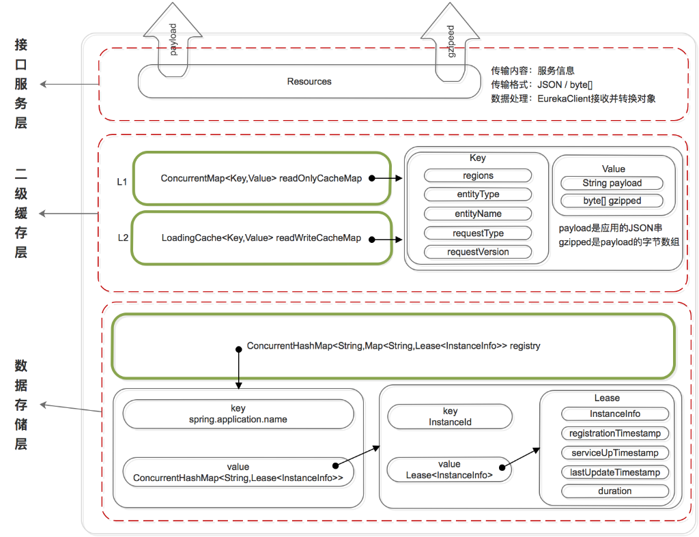

## 存储结构

Eureka 的数据存储分了两层：数据存储层和缓存层

### 相关实现类关系


`org.springframework.cloud.netflix.eureka.server.InstanceRegistry`

extends `com.netflix.eureka.registry.PeerAwareInstanceRegistryImpl`

extends`com.netflix.eureka.registry.AbstractInstanceRegistry`

implements``com.netflix.eureka.registry.InstanceRegistry`

> Spring-cloud-netflix-eureka是对com.netflix.eureka实现的封装

### 数据存储层 registry服务注册表

对注册服务的维护在`com.netflix.eureka.registry.AbstractInstanceRegistry`中实现

```java
private final ConcurrentHashMap<String, Map<String, Lease<InstanceInfo>>> registry
            = new ConcurrentHashMap<String, Map<String, Lease<InstanceInfo>>>();
```

registry由两层ConcurrentHashMap组成

- 第一层
  - key：注册的eureka客户端中`spring.application.name`配置的服务名
  - value：指向第二层ConcurrentHashMap的引用，表示key服务名对应的注册服务实例信息集合
- 第二层
  - key：注册的服务实例的InstanceId
  - value：Lease对象 包含了服务详情和服务治理相关的属性  

> Lease对象

### 二级缓存层 

在`com.netflix.eureka.registry.ResponseCacheImpl`中实现

在`com.netflix.eureka.registry.AbstractInstanceRegistry`中调用initializedResponseCache()实现

  

#### 一级缓存 readOnlyCacheMap

 ResponseCacheImpl中的`ConcurrentHashMap<Key,Value> readOnlyCacheMap`属性

本质上是 HashMap，无过期时间，保存服务信息的对外输出数据结构 

#### 二级缓存 readWriteCacheMap

 Loading<Key,Value> readWriteCacheMap

```java
protected final ConcurrentMap<String, InstanceStatus> overriddenInstanceStatusMap = CacheBuilder
            .newBuilder().initialCapacity(500)
            .expireAfterAccess(1, TimeUnit.HOURS)
            .<String, InstanceStatus>build().asMap();
```

本质上是 guava 的缓存，包含失效机制，保存服务信息的**对外输出**数据结构 

- Eureka Client 发送 register、renew 和 cancel 请求并更新 registry 注册表之后，删除二级缓存；

- Eureka Server 自身的 Evict Task 剔除服务后，删除二级缓存；

- 二级缓存本身设置了 guava 的失效机制，隔一段时间后自己自动失效；

## 数据维护

### 维护服务列表

 LeaseManager接口主要是维护可用服务清单的，它将服务的可能期限抽象为租约期限，该接口负责为一个实例的租约的创建、续约、和下线 


## 服务暴露

### 服务注册


### 获取服务实例

 LookupService 

> Lookup service for finding active instances.

## P2P集群同步

InstanceRegistry类继承了 PeerAwareInstanceRegistryImpl类，所以服务注册、续约、下线等操作完成后，会去调用PeerAwareInstanceRegistryImpl的相关逻辑。而PeerAwareInstanceRegistryImpl中主要是添加了一个广播的功能，拥有了将服务实例的注册、续约、下线等操作同步到其它Eureka Server的能力。
