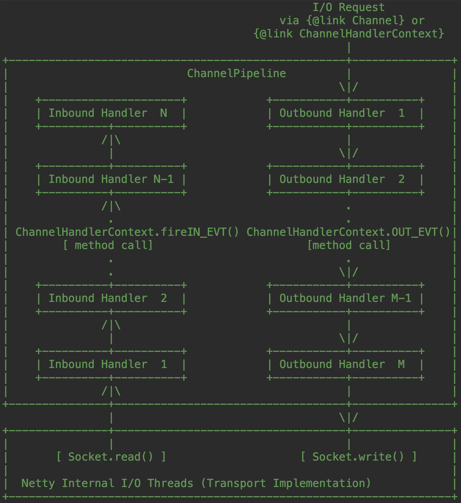

# 编程范式

## Server构建

1. 创建主线程循环组（接收分发请求与事件）和工作线程循环组（处理请求的事件）

   ```java
   NioEventLoopGroup boss=new NioEventLoopGroup();
   NioEventLoopGroup work=new NioEventLoopGroup();
   ServerBootstrap bootstrap=new ServerBootstrap();
   bootstrap.group(boss,work);
   ```

2. 配置channel（数据通道 pipeline）参数

   ```java
   bootstrap.channel(NioServerSocketChannel.class);
   bootstrap.childHandler(new NioWebSocketChannelInitializer());
   ```

   NioWebSocketChannelInitializer继承自在ChannelInitializer，在initChannel方法中给socketChannel的为pipeline添加数据处理的handler

3. 绑定服务端口，并启动

   ```java
   Channel channel = bootstrap.bind(8081).sync().channel();
   channel.closeFuture().sync();
   ```

## pipeline设置

pipeline是一系列handler的集合，请求数据被注册在pipeline中的handler依次处理

根据不同的协议会有不同的handler，按照协议对数据进行解析。在pipeline的末尾，添加自定义的handler，对将前面流水线处理好的数据，按业务逻辑进行解析处理以及相关的业务操作



## 自定义handler

netty开发的核心，请求处理添加自定义的业务逻辑

实现相关接口或者抽象类，如：

`SimpleChannelInboundHandler`处理网络读请求

`ChannelOutboundHandler`  处理网络写请求

## Channel管理

对于长链接（如WebSocket或者自己实现的长连接）的应用

# 与Spring整合

## 整合为Component

### 业务handler

业务处理，获取被前面pipeline中其他handler“处理好”的请求，多请求进行处理、解析

需要调用Spring容器管理的微服务客户端或者数据库dao进行业务操作

### netty server启动类

构建netty server，在构建server时，将业务handler bean添加到pipeline中

将构建/启动netty服务的方法暴露出来，在SpringBoot启动后调用这个方法启动netty（见下一节）

目的 将netty接入到Spring容器管理 获取Spring的能力

- 便于调用微服务 RPC Service和数据访问dao等业务实现

- 利用@Value注解读取SpringBoot的外部化配置

## 启动

- 使用标注`@PostConstruct`注解Component方法

- 实现`ApplicationRunner`接口在run方法中调用这个方法 

推荐后者

# 实践

## WebSocket推送服务

### 相关Handler解析

### Channel处理

使用静态

### 实践

将mq消费客户端获取的消息推送给连接的

## MQTT服务

### 架构模式

mqtt协议设备连接到mqtt中间件上

MQTT服务订阅mqtt中间件的topic，消费设备上报的数据


### 相关Handler解析

