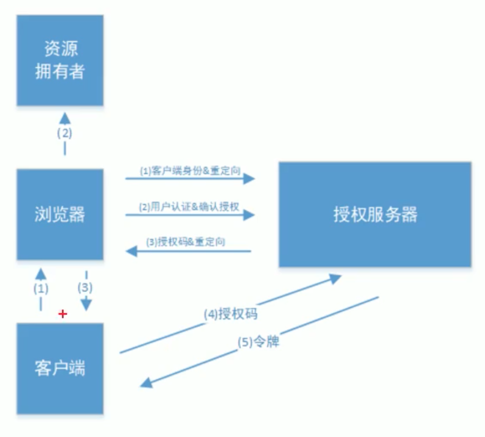

## 核心功能

保护系统数据和资源的安全

在访问系统的数据或者资源时，对用户身份的合法性进行校验

## 基本概念

### 用户身份认证

判断用户身份是否合法

常用的身份验证方式

- 用户名密码
- 手机app+二维码
- 手机短信验证码

### 会话

为了避免每次访问都进行用户身份认证

会话是系统用来**保持当前用户登录状态**的机制：将登录验证后的身份信息保存在会话中

常见的会话实现方式

- 基于session
- 基于token

#### session方式（服务端维护）

##### Servlet规范中自带的session实现

身份验证通过后将用户信息保存在sessionScope中

服务端将用户信息以键值对的形式存放到web容器中的**session容器**，并将键：session_id返回给客户端，客户端将session_id存放到**cookie**中

客户端在后续请求时，cookie中携带session_id，在session容器中可以获取对应的用户信息

##### 分布式session

将serlvet中的session容器，从servlet容器中移到公共的缓存数据库中

#### token方式（客户端维护）

身份验证通过后，服务端会返回token令牌（令牌中携带**加密的用户信息**），在后续访问请求携带token令牌

服务端对令牌进行解析（也可以作为键查询缓存），最终得到用户登录信息

### 授权

用户登录后，还需要控制数据和资源（功能）的访问权限

## OAuth2.0认证协议

OAuth - Open Auth - 开放的授权 不需要用户名密码的授权 是一种**接口规范**

是一个开放标注，在**不提供用户名和密码**给第三方应用或平台的前提下，允许用户授权**第三方应用**访问系统的资源

### 角色

第三方接入（OAuth的客户端）

授权方

- 资源所有者 - 授权

  通常是用户

- 授权认证服务器 - 权限验证

- 资源服务器 - 提供资源访问服务

### 接口规范

#### client_id和client_sercret

与第三方绑定，预先对接好

接入方提供给第三方，并保存在接入方数据库中

#### 获取令牌

- access_token

  - 携带经过加密的用户身份信息
  - 使用jwt来组织token中的内容

- refresh_token

- token_type

- expires_in

- scope

  令牌权限说明

#### 解析令牌


### 授权模式

颁发令牌模式 对应不同的接口规范

#### 授权码模式

给第三方颁发授权令牌 不暴露密码的情况下



1. **发起授权码** 资源拥有者打开链接

   链接由接入方提供，指向授权方授权服务器，携带第三方信息，例如

   ```
   /uaa/oauth/authorize?
   client_id=123456
   &response_type=code&scope=app
   &redirect_uri=http://xx.xx/notify
   ```

   get请求

   参数含义

   - client_id：用户端接入标识
   - response_type：授权码模式固定为code
   - scope：授权权限
   - redirect_uri：重定向uri，**授权成功**后会跳转到这个链接，并带上授权码code参数

2. **确认授权动作** 操作进行确认操作

   这个界面属于授权方，当包含接入方和资源拥有者的信息。资源拥有者点击确认后，表示确认授权，会调用redirect_uri返回授权码给第三方服务器

3. **获取token** 第三方使用授权码 向授权服务器获取资源访问令牌

   ```
   /uaa/oauth/token?
   client_id=123456
   &client_secret=qwert
   &grant_type=authorization_code
   &code=zxcvbbc&redirect_uri=http://xx.xx/notify
   ```

   get请求

   参数含义

   - client_id：用户端接入标识
   - response_type：授权码模式固定为code
   - scope：授权权限
   - redirect_uri：重定向uri，**授权成功**后会跳转到这个链接，并带上授权码code参数

#### 密码模式

内部颁发令牌 给自己的客户端

web页面登录

```
/uaa/oauth/token?
&grant_type=password
&client_id=123456
&client_sercret=qweqr
&username=
&password=zxczc
```

#### 客户端模式

一次登录后，客户端（手机app）保存client_id和client_secret

#### 简化模式

授权码模式的简化版，资源拥有者确认之后直接返回令牌token，省略了授权码换取token这一步这一步

## JWT

JSON WEB TOKEN 是一个开放的行业标准（RFC 7519） 

是一种简洁的、自包含的协议格式

用于传递json对象

传递的消息通过**数字签名**(加密 防止被篡改，HMAC算法或者RSA公私钥)可以被验证和信任

### JWT令牌结构

由Header、Payload、Sginature组成，使用`.`分隔

都是base64编码的字符串

- Header用来指定使用的加密算法

  ```json
  {
    "alg":"HS256",
    "typ":"JWT"
  }
  ```

- Payload用来存放有效信息

- Sginature签名

  对消息原文进行摘要算法 MD5，再使用私钥进行加密，生成签名

  收到令牌后，使用公钥进行加密，比较签名，**防止内容被串改**